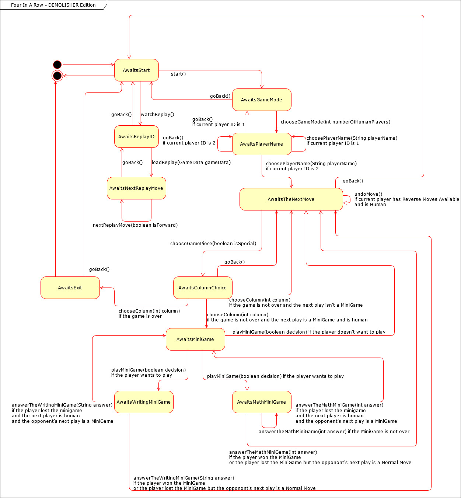
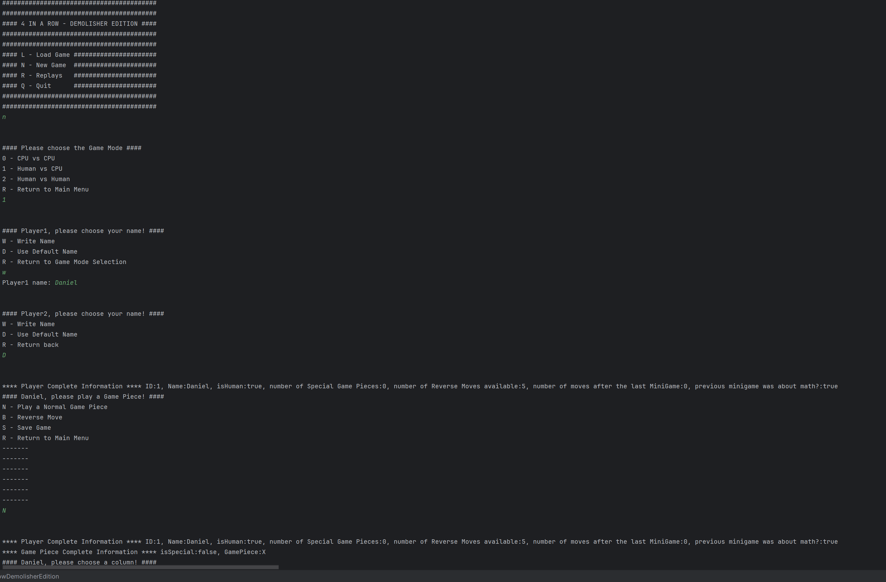
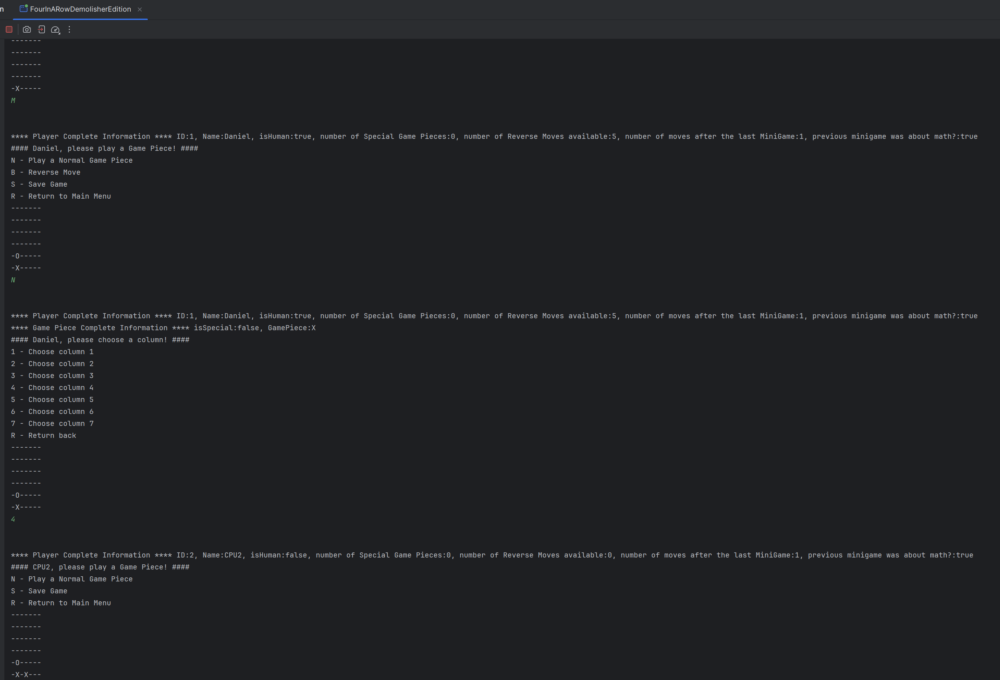
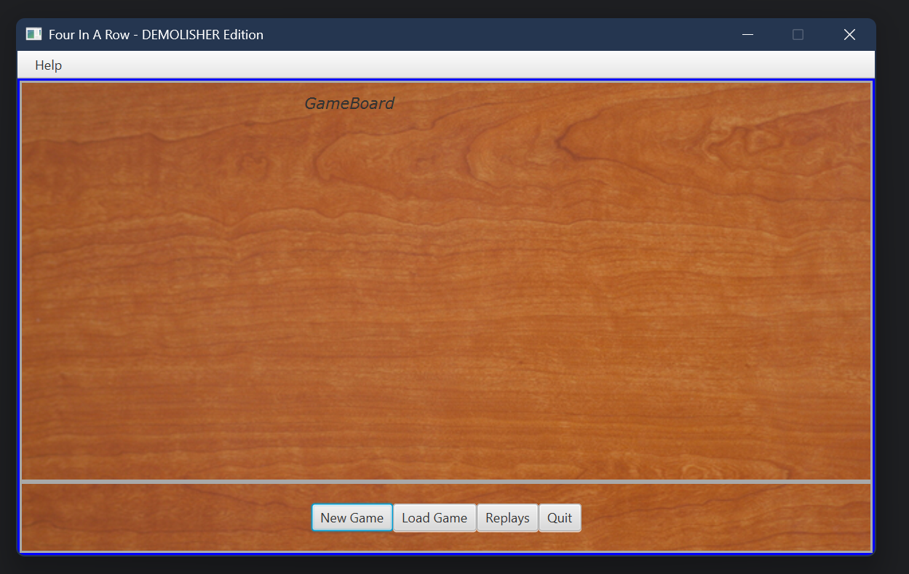

# Four in a Row: Demolisher Edition
A Java-based enhanced version of the classic "Four in a Row" game, featuring a state machine design, text and JavaFX graphical interfaces, special pieces, undo functionality, replays, and optional mini-games (math and writing challenges). Developed as part of an academic project in Advanced Programming at ISEC.

##### State Machine

##### Text User Interface

##### Graphical User Interface

Discover additional projects from this class in the [Programação Avançada (Advanced Programming) repository](https://github.com/danielmribeiro/isec-lei-programacao-avancada).

For more course-related assignments, check out the [Engenharia Informatica repository](https://github.com/danielmribeiro/engenharia-informatica).
